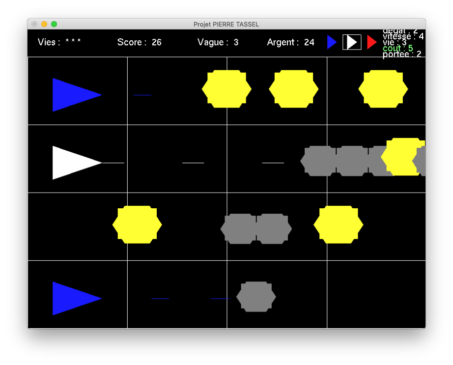

  <h1>Tower-Defense</h1>
  

-----------------

This project was done for class project in C++ and OpenGL.

It's an XCode project, but you can modify this code to work on any plateform by importing OpenGL library.

The game principale is close to Plants vs Zombies : https://fr.wikipedia.org/wiki/Plantes_contre_zombies

You can find a report un french and an UML diagramn inside the PDF file : [Rapport.pdf](Rapport.pdf)
